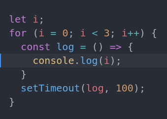

# Library

A basic JavaScript library app to practice event handling, objects, forms, and dialog modals.

**Live site:** [View the Library app]([https://gravitygravity.github.io/JS-library/])

## Functions

- **Objects:** Makes each book with a `Book` constructor and keeps all books in an array. Each book has a unique ID from `crypto.randomUUID()`.
- **Dialog modals:** Opens a `<dialog>` form when you click the "New Book" button.
- **Forms:** Adds a new book from the title, author, number of pages, and read status that you enter. The form uses `event.preventDefault()` to stop the default submit.
- **Event handling:** Removes a book when you click its "Remove" button. Changes the read status when you click its "Read" button. The read status uses a `Book` prototype function.
- **Display:** Shows each book on a card. The display code is separate from the book data.

### Reflection

#### What could I Improve
- Committing frequently and often.  I forget to commit often, its a bad habit.
- commenting consistently.  This will bite me again on longer code bases but these smaller projects dont require many comments not an excuse.

### What did I struggle with

- Queries and creating new dom nodes take a hefty amount of js code.  Feel like there should be shorter syntax for doing most of these tasks or a different approach.
- Learning form interactions within DOM webAPI

### What did I learn
- Improving commit messages with  ASD-STE100 Simplified Technical English standard
- learning more webAPI methods!
- JS objects interactions
